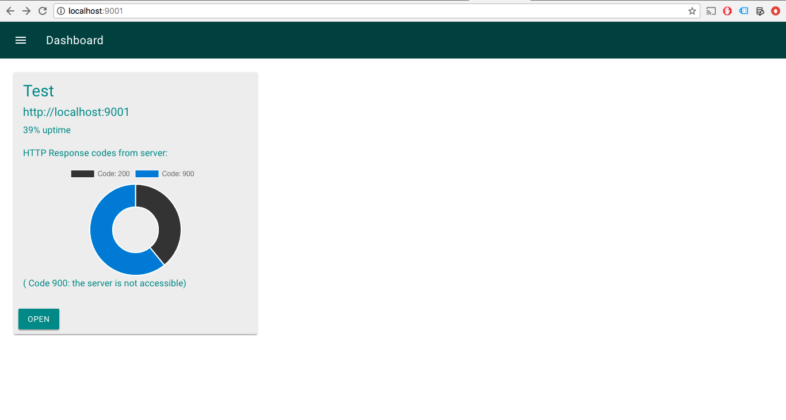
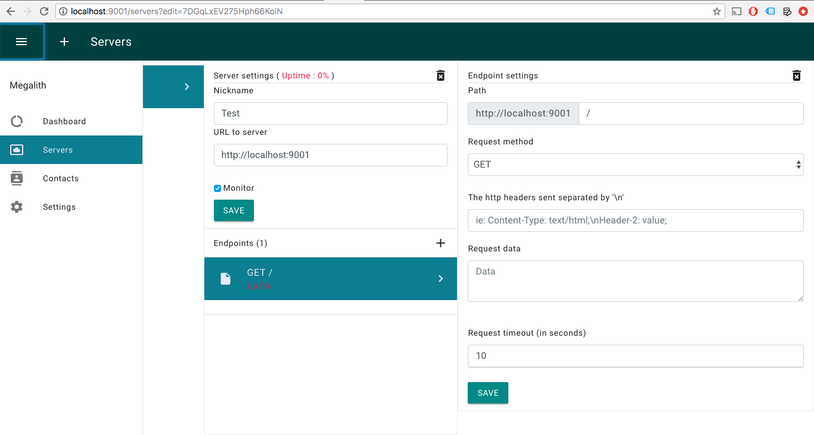
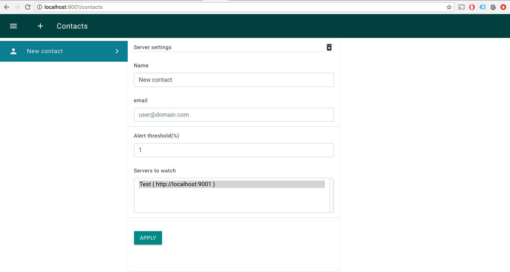
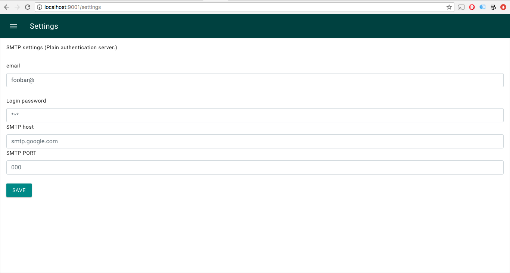

# Megalith
Web server health checker/monitor & uptime logger.

### Features :
- Track the uptime of any server.
- Alert your server's maintainers on downtime (SMS or email).
- Perfect for SLA reinforcements.

## Requirements (to build)
1. Go

## Install
Install with :
		
		$ go get github.com/cheikhshift/megalith

## Launch
Run the following command to launch application :
		
		$ megalith

## Projects used 
1. Twitter bootstrap beta 4.0.0-beta.2
2. Angular JS 1.5.6
3. Google Material design
3. Momentum 
4. GopherSauce
5. Chart.js

### Screenshots

